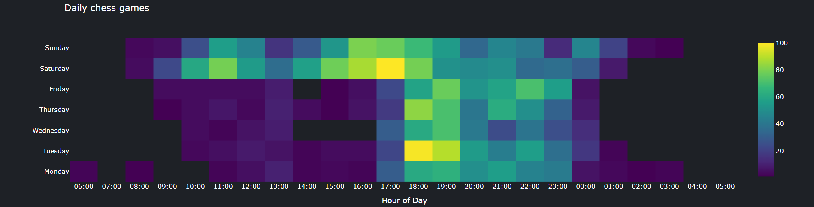
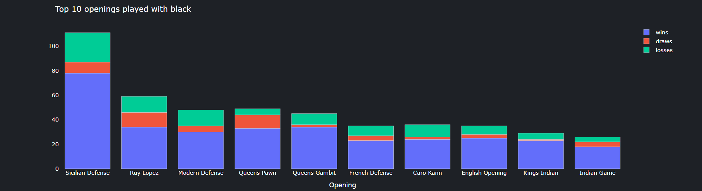
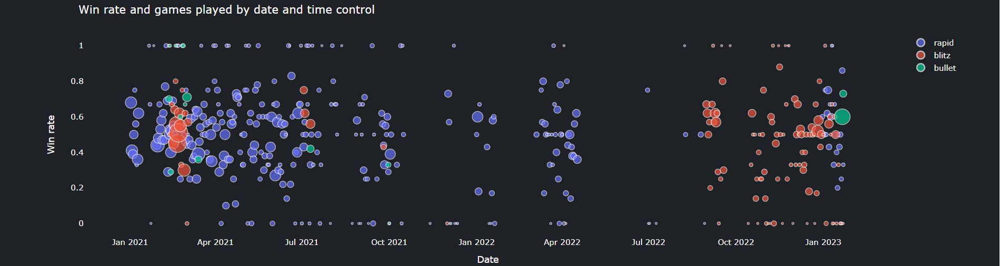

# Daily Chess Results

Visualize data and get insights on yours or your favorite players' daily chess habits.
For example, in which day of the week do you play the most and when do you get better results?
Does your win rate improve or decrease with the number of games played?

Check it out [here](https://daily-chess-results-production.up.railway.app/) 

Some samples of the visualizations you can expect:

